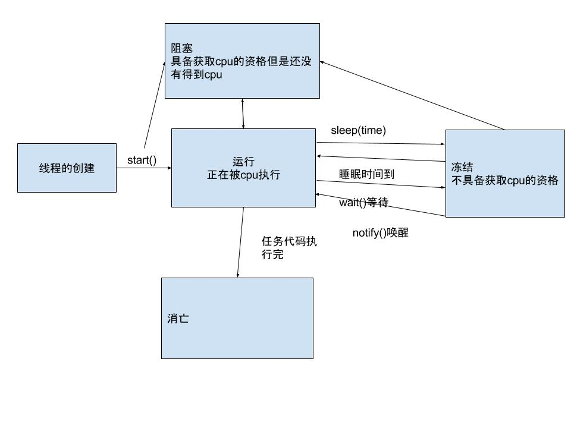

# 基础概念

进程：正在进行中的程序，一个应用就代表一个进程。windows任务管理器里面的每一个任务都是一个进程。

线程：举个例子，360安全卫士就是那个进程，电脑清理和优化加速。我在360里面点击电脑清理，一个线程开始执行，这是我再点击优化加速，另一个
线程启动。电脑清理和优化加速就是线程，它们通过轮流抢占cpu，交替执行各自的代码，实现感官上的同时执行，直到各自的代码执行完毕，线程结束
(从内存消失)。

> 进程可以看作是线程的集合，进程执行的本质是里面线程的执行，进程自己不能执行。

# 垃圾回收

jvm是个多线程程序，主线程负责执行代码，垃圾回收线程负责回收垃圾对象。在Object类里面定义了方法finalize(),垃圾线程执行该方法清理垃圾对象。
每个线程需要执行的代码叫做任务代码，都有它的存储位置。线程随着任务的存在而存在，随着任务的结束而结束。


public class Demo3 {

    public static void main(String[] args) {
        new Test();
        new Test();
        new Test();

        System.gc();//垃圾回收线程执行

        System.out.println("垃圾回收完毕");
    }
}

class Test {

    @Override
    protected void finalize() throws Throwable {
        System.out.println("垃圾回收执行");
    }
}


Thread.currentThread()返回当前占用cpu的线程

# 多线程程序的内存分配

多线程不遵循后进先出的原则，因为每个线程谁先执行完不确定。线程间是独立的，其它线程发生异常，不影响其它线程执行。都有各自的内存，所以线程执行完，进程就结束。

# 多线程的两种实现方式

### 第一种


	/**
	 * Created by on 16-9-20.
	 * 四个窗口同时卖票
	 */
	public class Demo4 {
	    public static void main(String[] args) {
	        Ticket t1 = new Ticket();
	        Ticket t2 = new Ticket();
	        Ticket t3 = new Ticket();
	        Ticket t4 = new Ticket();

	        t1.start();
	        t2.start();
	        t3.start();
	        t4.start();
	    }
	}

	class Ticket extends Thread {
	    private int num = 50;

	    @Override
	    public void run() {
	        if (num > 0) {
	            System.out.println(Thread.currentThread().getName() + "sale" + num--);
	        }
	    }
	}


执行的结果：

Thread-0sale50

Thread-2sale50

Thread-1sale50

Thread-3sale50

以上代码存在问题的，四个线程卖了同一张票，都是50，原因是4个线程都有各自的50张票，第一个线程执行任务，判断num大于0，卖了一张票，任务执行完毕，这里是第二个问题，只卖了一张的问题，我们要让线程卖完50张后再结束，所以这里应该用循环，下面是修改后的代码：


	public class Demo4 {
	    public static void main(String[] args) {
	        Ticket t1 = new Ticket();
	        Ticket t2 = new Ticket();
	        Ticket t3 = new Ticket();
	        Ticket t4 = new Ticket();

	        t1.start();
	        t2.start();
	        t3.start();
	        t4.start();
	    }
	}

	class Ticket extends Thread {
	    private static int num = 50;

	    @Override
	    public void run() {
	        while (true) {
	            if (num > 0) {
	                System.out.println(Thread.currentThread().getName() + "sale" + num--);
	            }
	        }
	    }
	}


结果：

Thread-0sale50
Thread-2sale49
Thread-2sale45
Thread-1sale48
Thread-2sale44
Thread-3sale46
Thread-0sale47
Thread-3sale41
Thread-3sale39
Thread-2sale42
Thread-1sale43
Thread-2sale37
Thread-3sale38
Thread-0sale40
Thread-3sale34
Thread-3sale32
Thread-2sale35
Thread-1sale36
Thread-2sale30
Thread-3sale31
Thread-0sale33
Thread-3sale27
Thread-3sale25
Thread-2sale28
Thread-1sale29
Thread-2sale23
Thread-3sale24
Thread-0sale26
Thread-3sale20
Thread-3sale18
Thread-2sale21
Thread-1sale22
Thread-2sale16
Thread-3sale17
Thread-0sale19
Thread-3sale13
Thread-3sale11
Thread-2sale14
Thread-1sale15
Thread-1sale8
Thread-2sale9
Thread-2sale6
Thread-3sale10
Thread-0sale12
Thread-3sale4
Thread-3sale2
Thread-3sale1
Thread-2sale5
Thread-1sale7
Thread-0sale3

把num变成了共享的变量，任务代码里用了while循环，新的问题是用了死循环后，票卖完了任务执结束不了，任务不结束，线程不结束，进程就一直运行；如果不用静态的共享变量，有其它办法吗？看第二种方法

### 第二种 实现接口

解决4个线程公共享票的问题，需要使用创建线程的第二种方式


	public class Demo5 {

	    public static void main(String[] args) {
	        Tickets ticket = new Tickets();

	        Thread t1 = new Thread(ticket);
	        Thread t2 = new Thread(ticket);
	        Thread t3 = new Thread(ticket);
	        Thread t4 = new Thread(ticket);

	        t1.start();
	        t2.start();
	        t3.start();
	        t4.start();
	    }
	}

	class Tickets implements Runnable {
	    private int num = 50;

	    @Override
	    public void run() {
	        while (true) {
	            if (num > 0) {
	                System.out.println(Thread.currentThread().getName() + "sale" + num--);
	            }
	        }
	    }
	}


这种方式对线程任务进行了描述，就是面向对象了。线程和任务分离，线程执行什么任务不再重要，只要实现了Runnalbe接口的子类对象都可以作为参数传递给Thread类构造方法。开发中常用第二种实现方式。

第二种方式实现接口还可以继承父类

# 线程状态

线程的生命是从创建开始的，调用了start()后线程具有获取cpu的资格。如果获取到cpu，当前线程处于运行状态，线程可以执行任务代码；如果有其它线程跟它一起争抢cpu，而这时它没有获取到cpu,它状态处于阻塞，虽然有获取cpu的资格，但是没有获取到cpu。当运行中的线程执行完任务，它就自动变成消亡的状态。以上的状态的发生不是人为干预的，下面说说人为干预的状态。sleep()、wait()、notify()是人为可控的状态，如图

# 存在的问题(卖票)

有4个线程执行卖票，t1,t2,t3,t4,结合上面代码24行分析，假设num = 1,t1先获取cpu执行到24行，判断num>0成立，

# 同步函数的锁

同步函数的锁是this,静态函数进内存不存在对象，但是存在所属类的字节码文件，属于Class类型的对象，所以静态同步函数的锁是它所属类的字节码文件Ticket.class

# 线程死锁

# 单例模式中懒汉式存在的线程安全问题

