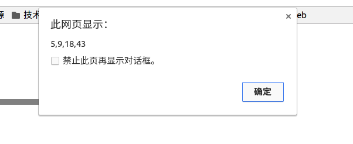

# 数组的创建

# 数组的方法

1.toString()

2.join()

指定toString()方法返回的字符创分隔符号

3.push()

向数组末尾添加数据，返回新数组的长度

4.pop()

从数组末尾删除数据，返回删除的数据

5.unshift()

向数组开头添加数据，返回新数组的长度

6.shift()

删除数组开头的数据，返回被删除的数据

7.concat()

基于当前数组创建新数组并返回改数组

8.slice()

截取制定区域数组返回一个新的数组

9.splice()

删除，插入，替换


	


上面的是删除操作，第一个参数2指定的是数组下标，第二个是删除的个数，把北京删除掉了，并返回北京，原来的数组数据改变，只有三个数据。

# 数组的排序

sort()返回排序好的数组(不生成新的数组)；没有参数默认按照ASCII字符升序排序

> ascii编码：任何的字符数字在计算机里都有对应的编码，例如，a-97,A-65,0-48。

sort()默认排序的是ascii码，要想改变排序规则，sort()提供一个带参数方法，方法的参数是一个函数，该函数提供排序依据给sort()，sort()根据返回的结果进行排序，看代码


	function paixu(m,n) {
		if (m > n) {
			return 1;
		} else if (m < n) {
			return -1;
		} else {
			return 0;
		}
	}

	var sor = [5,43,9,18];
	sor.sort(paixu);
	alert(sor);


或者这样


	function paixu(m,n) {
		return m - m;
	}

	var sor = [5,43,9,18];
	sor.sort(paixu);
	alert(sor);


结果：

