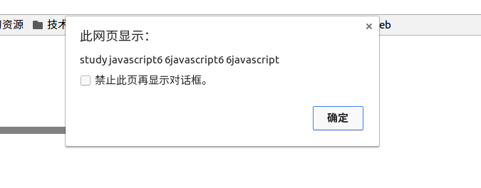
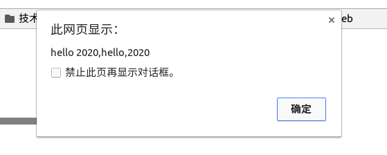
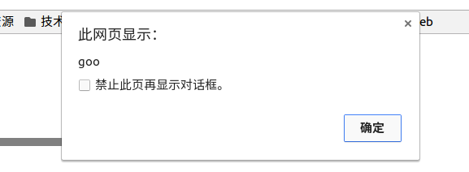
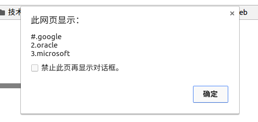

# 正则

为了验证字符串的合法性，同时减少代码量。验证客户端输入合法性，减少服务器端资源占用。

# 创建方式

1.new的方式

var reg = new RegExp(string,pattern);i:不区分大小写，g:全局匹配，m:多行匹配。

2.字面量方式

var reg = /hello/ig;

> test()和exec()，test()返回布尔，exec()返回匹配的字符。exec()返回的是数组对象，没有匹配的，返回null.

# String中提供的正则方法

1.match(),返回数组或者null,返回第一个匹配

2.search(),返回第一个和匹配表达式位置，只返回第一个位置，不需要全局匹配。

3.replace(pattern,replacement),替换匹配的字符串，默认只替换第一个符合。

4.split(pattern),按照正则表达式切割。

# 字符集

1. .代表任意字符，换行除外。

| 字符 | 含义 |
| :---: | :--: |
| . |  任意字符，换行除外 |
| ? |  0次或1次 |
| * |  0次或多次 |
| + |  1次或多次 |
| {m,n} |  m次到n次 |
| [a-z] |  限定某一位上取值范围 |
| [^a-z] |  取反 |
| \s |  空白字符，空格，制表，换行 |

{m,}至少出现m次，{m}出现m次

\d等价[0-9],\D等于[^0-9]

\w等于[a-zA-Z0-9]，\W等于[^a-zA-Z0-9]

^匹配开头，$匹配结尾

|或者，匹配给出任意

()分组，RegExp.$1取第一个分组值

# 贪婪 惰性

贪婪：+ * ? {m,n} {m,} {m} 惰性：+？ *? ?? {m,n}? {m,}? {m}?





贪婪的意思就是匹配表达式最大的，能匹配多少就匹配多少(尽量多的)，结果下如图

惰性与之相反，尽量匹配少的





结果是"study javascript 6javascript6 6javascript6"，只匹配第一组。

# 捕获性分组和非捕获性分组

1.捕获性分组





看结果

2.非捕获性分组





在不想捕获的分组前加如?:

3.前瞻捕获





匹配后面是gle那样的字符，结果是

# 换行模式





结果是只能替换第一个，用换行模式后可以匹配，像这样





# 常用

1.验证手机号





2.把手机号中间4位替换为****





